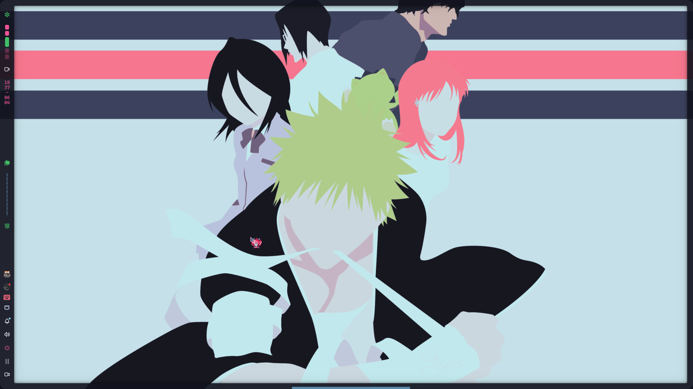
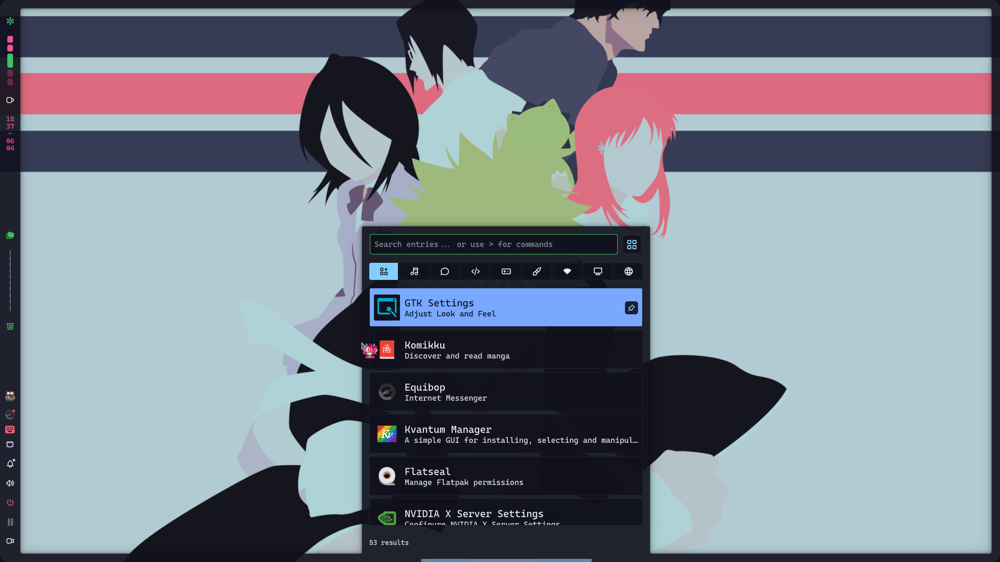
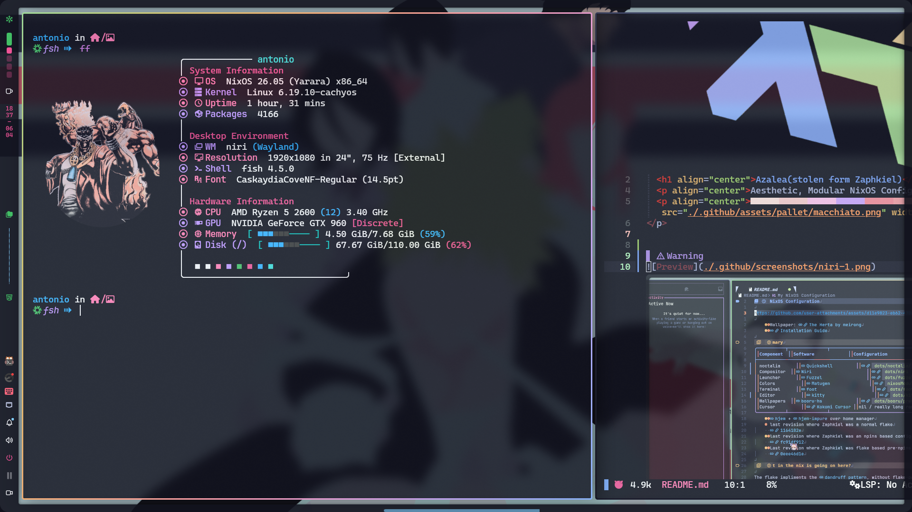
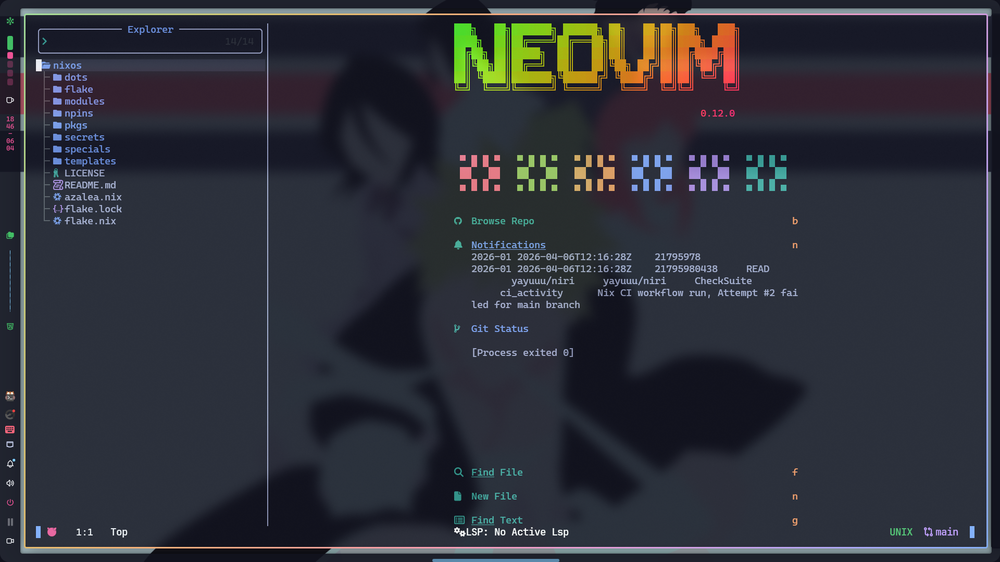
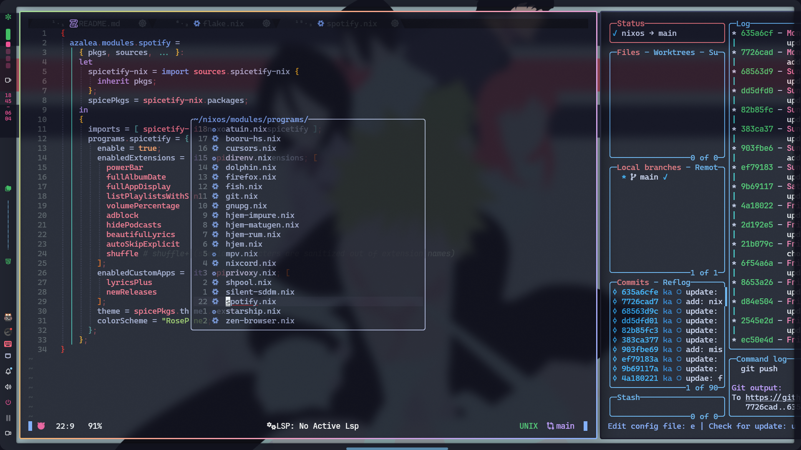
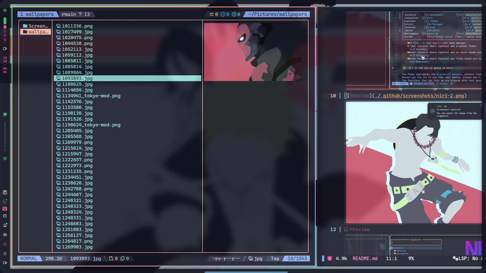

<p align="center">
  
  <h1 align="center">Azalea(stolen form Zaphkiel)</h1>
  <p align="center">Aesthetic, Modular NixOS Configuration</p>
  <p align="center"></p>
</p>

> [!WARNING]
> 
> 
> 
> 
> 
> 

- [Installation Guide][install guide]

## Summary

| Component | Software | Configuration |
| ---------- | -------------------------- | --------------------------------------------------------------------------- |
| noctalia | [noctalia] | [`dots/noctalia`][noctaliadots] |
| Compositor | [Niri] | [`dots/niri/config.kdl`][niridots] |
| Compositor | [Niri-Fork] | [`dots/niri/config.kdl`][niridots] |
| Launcher | [Fuzzel] | [`dots/fuzzel`][fuzldots] |
| Colors | [Matugen] | [`nixosModules/external/matugen/templates/`][mtgndots] |
| Terminal | [foot] | [`dots/foot/foot.ini`][footdots] |
| Editor | [Kitty] | [`dots/kitty/kitty.conf`][kittydots] |
| Wallpapers | [booru-hs] | [`dots/booru/preview.md`][booru images] |
| Cursor | [Kokomi Cursor][kokcursor] | nil / really long random text to make this table very wide yes looks like I |

- [hjem] + [hjem-impure] over home manager
- the laptop branch is the pre-azalea configuration [pre-azalea]
- this commit was testing branch for npins base [npins]
- ~~fix sddm weird eval input errors check~~
  \[`modules/nixosConfiguration.nix`\][hostConfig]

# **What in the nix is going on here?**

*The flake impliments the [dandruff pattern], without flake-parts. Should you try
it? If you like your sanity, please don't. The functions that set this up are
plagued with foot guns, which will be unpleasant to most people.*

## Acknowledgement

Firstly, I have to thank [sioodmy] for being the inspiration to ditch home
manager and writing wrappers myself. I had known of wrappers before, but if it
weren't for him, I wouldn't have heard of `pkgs.symlinkJoin` :D

I also extend my gratitude to [NotAShelf] for developing the hjem nixos module.
And also for his welcome criticism on some of the dumb nix code I've written.

After two months of being on a normal, sane, nixos configuration, I have
switched to the dandelion pattern (no I won't be spelling it correctly) largely
due to [argosnothing] shilling [jet]'s nixos configuration a great deal.

### Quickshell

- [nydragon/nysh][nysh]
- [end-4/dots-hyprland][enddots]
- [pikabar]
- [soramanew/rainingkurukuru][rainingkuru]
- [outfoxxed/nixnew][nixnew]
- [Rexcrazy804/Zaphkiel][zaphkiel]
- [noctalia-dev/noctalia-shell][noctalia-shell]
- one unmentioned individual that did not return
- and other homies in `#rice-discussion` of Hyprland discord

#### Nixvim

- [khaneliman/khanelivim][khanelivim]
- and other nixvim community

##### [IMPORTANT]

NOW nixpkgs using from npins sources. also can use mix with stable unstable and master respectivly. There is less flake input as much as possible help by flake-compat forked by lix.

```nix
    environment.systemPackages = with pkgs; [
        fastfetch ( unstable )
        master.fastfetch ( master branch )
        stable.fastfetch ( stable branch )
    ];
```

###### Licensing

All code in this repository is under the MIT license except wherever an explicit
licensing is included.

[argosnothing]: https://github.com/argosnothing
[booru images]: dots/booru/preview.md
[booru-hs]: https://github.com/Rexcrazy804/booru.hs
[dandruff pattern]: https://github.com/Michael-C-Buckley/nixos/blob/cfb8cfa3ee815cbb216cc3b9361373be4837a126/documentation/intent.md#dendritic-nix
[enddots]: https://github.com/end-4/dots-hyprland/tree/ii-qs/.config/quickshell
[foot]: https://codeberg.org/dnkl/foot
[footdots]: dots/foot/foot.ini
[fuzldots]: dots/fuzzel
[fuzzel]: https://codeberg.org/dnkl/fuzzel
[hjem]: https://github.com/feel-co/hjem
[hjem-impure]: https://github.com/Rexcrazy804/hjem-impure
[install guide]: dots/quickshell/kurukurubar/README.md
[jet]: https://github.com/Michael-C-Buckley
[khanelivim]: https://github.com/khaneliman/khanelivim
[kitty]: https://github.com/kovidgoyal/kitty.git
[kittydots]: dots/kitty/kitty.conf
[kokcursor]: https://www.pling.com/p/2167734/
[matugen]: https://github.com/InioX/matugen
[mtgndots]: dots/matugen/templates/
[niri]: https://github.com/niri-wm/niri.git
[niri-fork]: https://github.com/yayuuu/niri.git "Fork Fork blur and modifier only keybinding"
[niridots]: dots/niri/config.kdl
[nixnew]: https://git.outfoxxed.me/outfoxxed/nixnew/src/branch/master/modules/user/modules/quickshell
[noctalia]: https://noctalia.dev/
[noctalia-shell]: https://github.com/noctalia-dev/noctalia-shell
[noctaliadots]: dots/noctalia
[notashelf]: https://github.com/NotAShelf
[npins]: https://github.com/kagurazakei/shizuru/commit/5b385b698a39371af3fce05819787dadbc50b740
[nysh]: https://github.com/nydragon/nysh
[pikabar]: https://git.pika-os.com/wm-packages/pikabar/src/branch/main/pikabar/usr/share/pikabar
[pre-azalea]: https://github.com/kagurazakei/shizuru/commit/8d85cd72cd19134e54aca20d455220570c569407
[rainingkuru]: https://github.com/soramanew/rainingkuru
[sioodmy]: https://github.com/sioodmy
[zaphkiel]: https://github.com/Rexcrazy804/Zaphkiel
